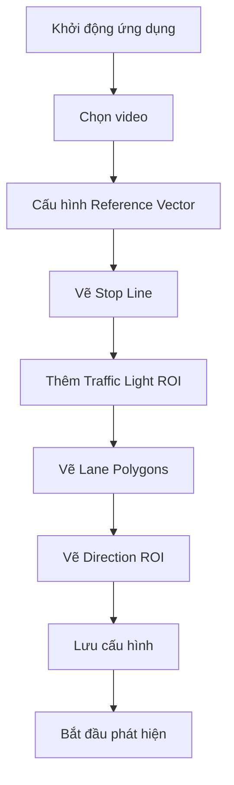

# 🚦 Traffic-Vision-AI

**Hệ thống phát hiện vi phạm giao thông thông minh** sử dụng Computer Vision và Deep Learning, tuân thủ **Luật Giao Thông Việt Nam** (Nghị định 100/2019, sửa đổi 123/2021).

[](https://www.python.org/downloads/)
[](https://github.com/ultralytics/ultralytics)
[](LICENSE)

---

## 📋 Mục Lục

- [✨ Tính Năng Chính](#-tính-năng-chính)
- [🏗️ Kiến Trúc Hệ Thống](#️-kiến-trúc-hệ-thống)
- [🛠️ Cài Đặt](#️-cài-đặt)
- [🚀 Khởi Chạy](#-khởi-chạy)
- [📖 Hướng Dẫn Sử Dụng](#-hướng-dẫn-sử-dụng)
- [🎯 Các Loại Vi Phạm](#-các-loại-vi-phạm)
- [⌨️ Phím Tắt](#️-phím-tắt)
- [📊 Cấu Trúc Dự Án](#-cấu-trúc-dự-án)
- [🔧 Cấu Hình Nâng Cao](#-cấu-hình-nâng-cao)
- [🐛 Xử Lý Lỗi](#-xử-lý-lỗi)
- [📚 Tài Liệu Kỹ Thuật](#-tài-liệu-kỹ-thuật)
- [👨‍💻 Tác Giả](#-tác-giả)

---

## ✨ Tính Năng Chính

### 🎯 Phát Hiện Vi Phạm

<table>
<tr>
<td width="50%">

**Vi Phạm Đèn Tín Hiệu**
- ✅ Vượt đèn đỏ (Red Light Running)
- ✅ Vượt vạch dừng (Stop Line Violation)
- ✅ Phân tích 60+ cases theo luật VN
- ✅ Hỗ trợ đèn tín hiệu đa hướng:
  - Đèn tròn (Circular)
  - Đèn mũi tên trái (Arrow Left)
  - Đèn mũi tên thẳng (Arrow Straight)
  - Đèn mũi tên phải (Arrow Right)

</td>
<td width="50%">

**Vi Phạm Làn Đường**
- ✅ Xe máy vào làn ô tô
- ✅ Ô tô vào làn xe máy
- ✅ Xe đi sai làn theo loại phương tiện
- ✅ Cấu hình loại xe cho từng làn:
  - Xe máy (Motorbike)
  - Ô tô (Car)
  - Xe bus (Bus)
  - Xe tải (Truck)
  - Xe đạp (Bicycle)

</td>
</tr>
</table>

### 🧠 Công Nghệ AI/ML

- **YOLOv8** - Object Detection cho 5 loại phương tiện
- **ByteTrack** - Multi-Object Tracking với re-identification
- **HSV Color Space** - Phát hiện màu đèn tín hiệu tự động
- **Trajectory Analysis** - Phân tích quỹ đạo để xác định hướng di chuyển
- **Direction Fusion** - Kết hợp ROI-based và Trajectory-based direction
- **Custom Trained Models** - YOLOv8 huấn luyện trên dataset giao thông Việt Nam

### 🎨 Giao Diện & Công Cụ

- **PyQt5 GUI** - Giao diện đồ họa hiện đại, thân thiện
- **Interactive ROI Editor** - Vẽ, chỉnh sửa vùng quan tâm:
  - Kéo thả điểm (Drag & Drop)
  - Thêm/xóa điểm polygon
  - Smooth polygon với Spline
  - Real-time preview
- **Config Management** - Lưu/tải cấu hình tự động theo video
- **Multi-view Toggle** - Bật/tắt hiển thị từng thành phần
- **Real-time Statistics** - Thống kê vi phạm, FPS, số lượng xe

---

## 🏗️ Kiến Trúc Hệ Thống

```
┌─────────────────────────────────────────────────────────────────┐
│                        VIDEO INPUT (MP4/AVI)                    │
└──────────────────────────┬──────────────────────────────────────┘
                           │
                           ▼
┌─────────────────────────────────────────────────────────────────┐
│              YOLO Detection (YOLOv8n/s/m/l/x)                   │
│         Output: bbox (x1,y1,x2,y2), class, confidence           │
└──────────────────────────┬──────────────────────────────────────┘
                           │
                           ▼
┌─────────────────────────────────────────────────────────────────┐
│           ByteTrack Multi-Object Tracking                        │
│           Output: track_id, bbox, class                          │
└─────┬──────────────┬──────────────┬─────────────┬───────────────┘
      │              │              │             │
      ▼              ▼              ▼             ▼
┌──────────┐  ┌──────────┐  ┌──────────┐  ┌─────────────┐
│   Lane   │  │   Stop   │  │ Traffic  │  │  Direction  │
│ Detector │  │   Line   │  │  Light   │  │   Fusion    │
│          │  │ Detector │  │ Detector │  │             │
└─────┬────┘  └─────┬────┘  └─────┬────┘  └──────┬──────┘
      │             │             │              │
      └─────────────┴─────────────┴──────────────┘
                           │
                           ▼
┌─────────────────────────────────────────────────────────────────┐
│                   Violation Engine                               │
│  • Lane Violation Check                                         │
│  • Red Light Violation Check (60 cases)                         │
│  • Stop Line Violation Check                                    │
│  • Direction Conflict Check                                     │
└──────────────────────────┬──────────────────────────────────────┘
                           │
                           ▼
┌─────────────────────────────────────────────────────────────────┐
│              PyQt5 UI + Real-time Visualization                 │
│         Display: Bounding Boxes, Labels, Statistics             │
└─────────────────────────────────────────────────────────────────┘
```

---

## 🛠️ Cài Đặt

### Yêu Cầu Hệ Thống

| Thành phần | Yêu cầu tối thiểu | Khuyến nghị |
|------------|-------------------|-------------|
| **OS** | Windows 10, Ubuntu 20.04, macOS 11+ | Windows 11, Ubuntu 22.04 |
| **Python** | 3.8+ | 3.10+ |
| **RAM** | 8GB | 16GB+ |
| **GPU** | CPU only (chậm) | NVIDIA GPU + CUDA 11.8+ |
| **Storage** | 2GB | 5GB+ (cho models và videos) |

### Cài Đặt Thư Viện

```bash
# Clone repository
git clone https://github.com/dangdoday/Traffic-Vision-AI.git
cd Traffic-Vision-AI

# Cài đặt dependencies
pip install -r requirements.txt
```

**Thư viện chính:**
- `ultralytics>=8.0.0` - YOLOv8 framework
- `opencv-python>=4.8.0` - Computer vision
- `PyQt5>=5.15.0` - GUI framework
- `numpy>=1.24.0` - Numerical computing
- `torch>=2.0.0` - Deep learning (tự động cài qua ultralytics)

### Cài Đặt GPU (Khuyến nghị)

```bash
# CUDA 11.8
pip install torch torchvision --index-url https://download.pytorch.org/whl/cu118

# CUDA 12.1
pip install torch torchvision --index-url https://download.pytorch.org/whl/cu121
```

---

## 🚀 Khởi Chạy

### Chế Độ GUI (Khuyến nghị)

```bash
cd src
python integrated_main.py
```

### Chế Độ Command Line

```bash
cd src
python main.py --video path/to/video.mp4 --config path/to/config.json
```

### Các Tùy Chọn Nâng Cao

```bash
# Chọn model YOLOv8
python integrated_main.py --model yolov8n.pt  # Nhanh nhất
python integrated_main.py --model yolov8s.pt  # Cân bằng
python integrated_main.py --model yolov8m.pt  # Chính xác hơn

# Chế độ realtime (giảm độ trễ)
python integrated_main.py --realtime

# Điều chỉnh FPS
python integrated_main.py --fps 30
```

---

## 📖 Hướng Dẫn Sử Dụng

### Quy Trình Cấu Hình Hoàn Chỉnh



---

### 1️⃣ Khởi Động và Chọn Video

1. **Chạy ứng dụng:**
   ```bash
   cd src
   python integrated_main.py
   ```

2. **Chọn video:** Hộp thoại sẽ tự động hiện ra
   - Hỗ trợ: MP4, AVI, MOV, MKV
   - Hoặc: Menu `File → Select Video`

3. **Model tự động load:**
   - Mặc định: YOLOv8n (nhanh, FPS cao)
   - Đổi model: Menu `Settings → Select Model`
   - Custom model: Đặt `.pt` file vào `models/yolov8/`

---

### 2️⃣ Cấu Hình Reference Vector ⭐ **BẮT BUỘC**

**Reference Vector** là vector tham chiếu cho camera nghiêng, giúp hệ thống hiểu đúng hướng di chuyển của xe.

#### Tại Sao Cần Reference Vector?

<table>
<tr>
<td width="50%">

**Không có Reference Vector:**
- ❌ Hệ thống không biết "trái/phải" thực tế
- ❌ Xe rẽ trái bị nhận là rẽ phải
- ❌ Direction detection sai 100%

</td>
<td width="50%">

**Có Reference Vector:**
- ✅ Hiệu chỉnh góc camera nghiêng
- ✅ Phân tích quỹ đạo chính xác
- ✅ Phát hiện hướng đúng: ⬅️ ⬆️ ➡️

</td>
</tr>
</table>

#### Cách Vẽ Reference Vector

1. **Mở tool:** Menu `Draw → Set Reference Vector` hoặc nút toolbar
2. **Click 2 điểm** trên làn đường thẳng:
   ```
   Điểm 1 (gốc)  ──────────→  Điểm 2 (đích)
                theo chiều xe chạy
   ```
3. **Lưu ý:**
   - ⚠️ Vector phải nằm trên **làn thẳng**, không vẽ trên khúc cua
   - ⚠️ Hướng từ điểm 1 → điểm 2 = hướng chính của luồng xe
   - ⚠️ Độ dài vector: **50-100 pixel** là đủ

#### Ví Dụ Minh Họa

```
            ↑ Hướng xe chạy
            │
    ─────────────────────────
   │     [1]────→[2]         │  ✅ ĐÚNG: Vector theo chiều xe
   │     Reference Vector     │
    ─────────────────────────

    ─────────────────────────
   │     [2]←────[1]         │  ❌ SAI: Vector ngược chiều
    ─────────────────────────
```

---

### 3️⃣ Vẽ Stop Line (Vạch Dừng)

**Stop Line** = Vạch dừng đèn đỏ, dùng để phát hiện vượt đèn đỏ.

#### Các Bước

1. **Mở tool:** Menu `Draw → Set Stop Line` hoặc nút "Set Stop Line"
2. **Click 2 điểm** để tạo đường thẳng ngang qua vạch dừng:
   ```
   [Điểm 1] ──────────────── [Điểm 2]
              (vạch dừng)
   ```
3. **Lưu ý:**
   - Chỉ cần 1 stop line cho toàn bộ video
   - Vẽ vuông góc với hướng xe di chuyển
   - Nếu đã có, vẽ lại sẽ ghi đè

#### Kiểm Tra Stop Line

- Bật hiển thị: Menu `View → Show Stop Line` hoặc `Ctrl+P`
- Đường màu **đỏ đậm** trên video
- Xe vượt qua = potential violation (nếu đèn đỏ)

---

### 4️⃣ Thêm Traffic Light ROI (Đèn Tín Hiệu)

**Traffic Light ROI** = Vùng chứa đèn giao thông để hệ thống tự động phát hiện màu (đỏ/vàng/xanh).

#### Các Bước

1. **Mở tool:** Menu `Draw → Add Traffic Light` hoặc nút "Add Traffic Light"
2. **Click 2 điểm** để vẽ hình chữ nhật bao quanh đèn:
   ```
   [1]───────┐
   │   🔴    │  Bao đúng vùng đèn
   └───────[2]
   ```
3. **Chọn loại đèn trong dialog:**

| Loại Đèn | Ý Nghĩa | Ảnh Hưởng Vi Phạm |
|----------|---------|-------------------|
| **Normal (Circular)** | Đèn tròn 3 màu | Áp dụng cho tất cả hướng |
| **Arrow Left** | Đèn mũi tên trái | Chỉ kiểm tra xe rẽ trái |
| **Arrow Straight** | Đèn mũi tên thẳng | Chỉ kiểm tra xe đi thẳng |
| **Arrow Right** | Đèn mũi tên phải | Chỉ kiểm tra xe rẽ phải |

#### Lưu Ý Quan Trọng

- ✅ Bao **đúng vùng đèn**, không quá rộng
- ✅ Không để ROI chứa nền xung quanh
- ✅ Có thể thêm **nhiều đèn** (đèn rẽ + đèn thẳng)
- ✅ Hệ thống tự động track màu bằng **HSV color space**

#### Xóa Traffic Light

- Menu `Delete → Delete Traffic Light` → Chọn đèn cần xóa

---

### 5️⃣ Vẽ Lane (Làn Đường)

**Lane** = Vùng làn đường để phát hiện **xe đi sai làn** theo loại phương tiện.

#### Các Bước Vẽ Lane

1. **Mở tool:** Menu `Draw → Draw Lane` hoặc nút "Add Lane"
2. **Click nhiều điểm** để tạo polygon bao quanh làn:
   ```
   [1]────[2]
   │      │
   │ LANE │  ← Polygon bao quanh làn đường
   │      │
   [4]────[3]
   ```
3. **Double-click điểm cuối** để hoàn tất polygon
4. **Chọn loại xe được phép** trong dialog:

| Tùy Chọn | Ý Nghĩa | Use Case |
|----------|---------|----------|
| ✅ All vehicles | Tất cả phương tiện | Làn chung |
| ✅ Xe máy | Chỉ xe máy + xe đạp | Làn xe máy |
| ✅ Ô tô | Chỉ ô tô | Làn ô tô |
| ✅ Xe bus | Chỉ xe bus | Bus lane |
| ✅ Xe tải | Chỉ xe tải | Làn xe nặng |

#### Chỉnh Sửa Lane

1. **Mở chế độ edit:** Menu `Edit → Edit Lane` → Chọn lane từ danh sách
2. **Các thao tác:**
   - **Kéo điểm:** Left-click + drag
   - **Thêm điểm:** Double-click **gần cạnh** polygon
   - **Xóa điểm:** Right-click trên điểm (tối thiểu 3 điểm)
3. **Hoàn tất:** Nhấn `Enter` → Cấu hình lại loại xe

#### Smooth Lane Polygon

- Menu `Edit → Smooth Lane` → Chọn lane
- Làm mượt các góc cạnh bằng Spline interpolation

#### Xóa Lane

- Menu `Delete → Delete Lane` → Chọn lane cần xóa

---

### 6️⃣ Vẽ Direction ROI (Vùng Phát Hiện Hướng)

**Direction ROI** = Vùng để phát hiện xe đi sai hướng khi vi phạm đèn đỏ.

#### Tại Sao Cần Direction ROI?

Giao thông Việt Nam phức tạp:
- ❌ Xe không đi theo làn cố định
- ❌ Không thể dựa vào lane-line
- ✅ **Solution:** Chia vùng theo hướng đi

#### Các Bước Vẽ Direction ROI

1. **Mở tool:** Menu `Draw → Draw Direction ROI`
2. **Click nhiều điểm** để tạo polygon:
   ```
   [1]────[2]
   │      │
   │ ROI  │  ← Vùng xe rẽ trái đi qua
   │      │
   [4]────[3]
   ```
3. **Double-click điểm cuối** để hoàn tất
4. **Nhấn "Finish Direction ROI"**
5. **Cấu hình hướng đi:**
   - ✅ Chọn hướng cho phép: ⬅️ Left / ⬆️ Straight / ➡️ Right
   - ✅ Chọn primary direction (màu hiển thị):
     - 🔴 Left (Red)
     - 🟢 Straight (Green)
     - 🟡 Right (Yellow)

#### Chỉnh Sửa Direction ROI

- Menu `Edit → Edit Direction ROI` → Chọn ROI
- Thao tác giống như edit Lane
- Hoàn tất: `Enter` → Cấu hình lại hướng

#### Xóa Direction ROI

- Menu `Delete → Delete Direction ROI` → Chọn ROI cần xóa

---

### 7️⃣ Bắt Đầu Phát Hiện

1. **Nhấn nút "Start Detection"**
2. **Video bắt đầu chạy với overlay:**
   - 🟦 Hộp xanh: Xe bình thường
   - 🔴 Hộp đỏ + **[LANE]**: Vi phạm làn đường
   - 🔴 Hộp đỏ + **[RED LIGHT]**: Vượt đèn đỏ
   - Hiển thị: Track ID, Class, Direction

3. **Thống kê real-time:**
   - FPS Detection
   - FPS Display
   - Số xe máy qua
   - Số ô tô qua
   - Tổng vi phạm

---

### 8️⃣ Lưu và Tải Cấu Hình

#### Lưu Tự Động

Cấu hình được tự động lưu khi:
- Vẽ/chỉnh sửa Lane
- Thêm/xóa Traffic Light
- Vẽ Direction ROI
- Đặt Stop Line / Reference Vector

**Vị trí:** `configs/<tên_video>_config.json`

#### Lưu Thủ Công

- Menu `File → Save Config`
- Chọn vị trí lưu file `.json`

#### Tải Cấu Hình

- Menu `File → Load Config`
- Chọn file `.json` đã lưu trước

#### Cấu Trúc File Config

```json
{
  "video_name": "traffic.mp4",
  "lanes": [
    {
      "points": [[x1, y1], [x2, y2], ...],
      "allowed_labels": [0, 3]  // ô tô, xe máy
    }
  ],
  "stop_line": [[x1, y1], [x2, y2]],
  "traffic_lights": [
    {
      "bbox": [x1, y1, x2, y2],
      "type": "normal",
      "color": "red"
    }
  ],
  "direction_rois": [
    {
      "points": [[x1, y1], ...],
      "allowed_directions": ["left", "straight"],
      "primary_direction": "left"
    }
  ],
  "reference_vector": [[x1, y1], [x2, y2]]
}
```

---

## 🎯 Các Loại Vi Phạm

### Theo Nghị Định 100/2019 (Sửa Đổi 123/2021)

#### 1. Vượt Đèn Đỏ (Red Light Running)

**Mức phạt:** 4-6 triệu VNĐ + Tước GPLX 1-3 tháng

**Điều kiện vi phạm:**
```python
IF (traffic_light == RED):
    IF (vehicle_crossed_stop_line):
        IF (vehicle_direction == straight OR left):
            → VIOLATION: Red Light Running
        ELSE IF (vehicle_direction == right):
            → NO VIOLATION (rẽ phải khi đèn đỏ được phép)
```

**Logic phát hiện:**
- ✅ Kiểm tra xe đã vượt stop line (`is_on_stop_line()`)
- ✅ Kiểm tra màu đèn tương ứng với hướng đi
- ✅ Đèn mũi tên: Chỉ kiểm tra hướng đó
- ✅ Đèn tròn: Kiểm tra tất cả hướng

**60 Cases phân tích:** Xem [COMPLETE_VIOLATION_CASES.md](docs/COMPLETE_VIOLATION_CASES.md)

---

#### 2. Vượt Vạch Dừng (Stop Line Violation)

**Mức phạt:** 1-2 triệu VNĐ

**Điều kiện vi phạm:**
```python
IF (traffic_light == RED OR YELLOW):
    IF (vehicle_front_on_stop_line):
        → VIOLATION: Stop Line Violation
```

---

#### 3. Vi Phạm Làn Đường (Lane Violation)

**Mức phạt:** 400,000 - 600,000 VNĐ

**Điều kiện vi phạm:**
```python
IF (vehicle_in_lane):
    IF (vehicle_class NOT IN lane_allowed_classes):
        → VIOLATION: Lane Violation
```

**Ví dụ:**
- Xe máy vào làn ô tô: **VI PHẠM**
- Ô tô vào làn xe máy: **VI PHẠM**
- Xe bus vào làn ô tô: **KHÔNG VI PHẠM** (nếu lane cho phép)

---

#### 4. Đi Sai Hướng Khi Đèn Đỏ

**Mức phạt:** 4-6 triệu VNĐ (kết hợp với vượt đèn đỏ)

**Điều kiện vi phạm:**
```python
IF (traffic_light == RED):
    IF (vehicle_direction NOT IN allowed_directions):
        → VIOLATION: Wrong Direction + Red Light
```

---

## ⌨️ Phím Tắt

### Chế Độ Vẽ/Chỉnh Sửa

| Phím | Chức Năng | Mô Tả |
|------|-----------|-------|
| `Double-click` | Thêm điểm | Thêm điểm mới khi đang vẽ ROI |
| `Enter` | Hoàn tất | Kết thúc chỉnh sửa Lane/ROI |
| `Delete` | Hiển thị hướng dẫn | Hướng dẫn xóa điểm |
| `Right-click` | Xóa điểm | Xóa điểm khi đang chỉnh sửa (min 3 điểm) |
| `ESC` | Hủy | Hủy thao tác hiện tại |

### View Toggles

| Phím | Chức Năng | Toggle |
|------|-----------|--------|
| `Ctrl+L` | Lanes | Hiện/ẩn làn đường |
| `Ctrl+P` | Stop Line | Hiện/ẩn vạch dừng |
| `Ctrl+T` | Traffic Lights | Hiện/ẩn đèn giao thông |
| `Ctrl+V` | Reference Vector | Hiện/ẩn vector tham chiếu |
| `Ctrl+D` | Direction ROI | Hiện/ẩn vùng hướng đi |
| `Ctrl+A` | All Boxes | Hiện/ẩn tất cả bounding box |

### Control

| Phím | Chức Năng |
|------|-----------|
| `Space` | Pause/Resume video |
| `Ctrl+S` | Lưu cấu hình |
| `Ctrl+O` | Mở video mới |
| `Ctrl+Q` | Thoát ứng dụng |

---

## 📊 Cấu Trúc Dự Án

```
Traffic-Vision-AI/
│
├── 📁 src/                              # Source code chính
│   ├── integrated_main.py               # 🚀 Main entry point (750 lines)
│   ├── main.py                          # Alternative entry
│   ├── model_config.py                  # Model configuration
│   ├── run_app.py                       # Application launcher
│   │
│   ├── 📁 core/                         # Core modules (OOP architecture)
│   │   ├── vehicle_tracker.py          # ByteTrack tracking
│   │   ├── violation_detector.py       # Violation detection logic
│   │   ├── violation_engine.py         # Violation checking (60 cases)
│   │   ├── traffic_light_manager.py    # Traffic light state management
│   │   ├── stopline_manager.py         # Stop line detection
│   │   ├── direction_estimator.py      # Direction estimation
│   │   ├── direction_fusion.py         # Multi-source direction fusion
│   │   ├── roi_direction_manager.py    # ROI-based direction
│   │   ├── trajectory_direction_analyzer.py  # Trajectory-based direction
│   │   ├── tl_detector.py              # Traffic light color detection
│   │   └── video_thread.py             # Multi-threaded video processing
│   │
│   ├── 📁 handlers/                     # Event handlers (Mixin pattern)
│   │   ├── config_handler.py           # Config save/load
│   │   ├── detection_handler.py        # Detection processing
│   │   ├── dialog_handler.py           # UI dialogs
│   │   ├── direction_roi_handler.py    # Direction ROI operations
│   │   ├── display_handler.py          # Display rendering
│   │   ├── event_handler.py            # UI events
│   │   ├── lane_handler.py             # Lane operations
│   │   ├── model_handler.py            # Model management
│   │   ├── reference_vector_handler.py # Reference vector ops
│   │   ├── traffic_light_handler.py    # Traffic light ops
│   │   └── video_handler.py            # Video playback control
│   │
│   ├── 📁 ui/                           # User interface components
│   │   ├── main_window.py              # Main window layout
│   │   ├── overlay_drawer.py           # Draw overlays on video
│   │   ├── lane_selector.py            # Lane type selection dialog
│   │   ├── stopline_selector.py        # Stop line editor
│   │   ├── vehicle_type_dialog.py      # Vehicle type dialog
│   │   └── visualization.py            # Visualization utilities
│   │
│   ├── 📁 tools/                        # Standalone tools
│   │   ├── roi_editor.py               # Interactive ROI editor
│   │   ├── roi_direction_editor.py     # Direction ROI editor
│   │   └── reference_vector_calibrator.py  # Reference vector calibration
│   │
│   ├── 📁 utils/                        # Utility functions
│   │   ├── config_manager.py           # Config file management
│   │   ├── geometry_utils.py           # Geometry calculations
│   │   ├── geometry.py                 # Geometry primitives
│   │   └── video_utils.py              # Video processing utilities
│   │
│   ├── 📁 models/                       # Model wrappers
│   │   ├── base_model.py               # Base model interface
│   │   └── yolov8.py                   # YOLOv8 implementation
│   │
│   ├── 📁 managers/                     # State managers
│   │   ├── lane_manager.py             # Lane state management
│   │   └── stopline_manager.py         # Stop line management
│   │
│   └── 📁 app/                          # Application modules
│       ├── direction_logic.py          # Direction calculation logic
│       ├── globals.py                  # Global variables
│       ├── state_manager.py            # Application state
│       ├── utils_detection.py          # Detection utilities
│       ├── 📁 detection/               # Detection components
│       └── 📁 geometry/                # Geometry components
│
├── 📁 models/                           # Pre-trained models
│   ├── README.md                        # Model documentation
│   └── 📁 yolov8/                       # YOLOv8 weights
│       ├── batch16_size416_100epoch.pt  # Custom trained (416x416)
│       ├── batch64_size640_100epoch.pt  # Custom trained (640x640)
│       └── README.md
│
├── 📁 configs/                          # Auto-saved configurations
│   ├── sample_traffic_video_config.json
│   ├── video1_config.json
│   └── ...
│
├── 📁 docs/                             # Documentation
│   ├── COMPLETE_LOGIC_ANALYSIS.md       # Vi phạm logic analysis (60 cases)
│   ├── COMPLETE_VIOLATION_CASES.md      # Chi tiết 60 cases vi phạm
│   ├── DIRECTION_DETECTION.md           # Direction detection system
│   ├── DIRECTION_INTEGRATION_GUIDE.md   # Integration guide
│   └── TRAFFIC_LIGHT_RULES_VN.md        # Luật đèn giao thông VN
│
├── requirements.txt                     # Python dependencies
└── README.md                            # This file

```

### Architecture Highlights

#### 1. **OOP Core Architecture**

```python
# Core modules sử dụng OOP pattern
VehicleTracker         → ByteTrack tracking
ViolationDetector      → Phát hiện vi phạm
TrafficLightManager    → Quản lý đèn tín hiệu
DirectionFusion        → Kết hợp direction sources
```

#### 2. **Mixin Pattern cho Handlers**

```python
class MainWindow(
    QMainWindow,
    DirectionROIHandlerMixin,
    ReferenceVectorHandlerMixin,
    TrafficLightHandlerMixin,
    LaneHandlerMixin,
    ConfigHandlerMixin,
    EventHandlerMixin,
    ModelHandlerMixin,
    DisplayHandlerMixin,
    DialogHandlerMixin,
    VideoHandlerMixin,
    DetectionHandlerMixin
):
    # Clean separation of concerns
    pass
```

#### 3. **Multi-threaded Processing**

```python
VideoThread (QThread) → Non-blocking video processing
    ├─ YOLO Detection
    ├─ ByteTrack Tracking
    ├─ Violation Checking
    └─ Signal emit to UI
```

---

## 🔧 Cấu Hình Nâng Cao

### Điều Chỉnh Model

#### Chọn Model Khác Nhau

| Model | Speed (FPS) | Accuracy | VRAM | Use Case |
|-------|-------------|----------|------|----------|
| YOLOv8n | **60+** | Good | 2GB | Real-time, low-end GPU |
| YOLOv8s | **40-50** | Better | 4GB | Balanced |
| YOLOv8m | **30-40** | High | 6GB | High accuracy needed |
| YOLOv8l | 20-30 | Very High | 8GB | Research |
| YOLOv8x | 15-20 | Best | 10GB+ | Offline processing |

#### Sử Dụng Custom Model

1. **Train model:**
   ```bash
   yolo train data=traffic_data.yaml model=yolov8n.pt epochs=100
   ```

2. **Đặt model vào:**
   ```
   models/yolov8/your_custom_model.pt
   ```

3. **Chọn trong UI:**
   - Menu `Settings → Select Model` → Chọn custom model

---

### Tối Ưu FPS

#### 1. Giảm Resolution

```python
# Trong config hoặc settings
detection_size = 416  # Thay vì 640
```

#### 2. Bật Realtime Mode

- Menu `Settings → Enable Realtime Mode`
- Bỏ qua một số frame để tăng FPS

#### 3. Điều Chỉnh Confidence Threshold

```python
# Lower threshold = faster but more false positives
conf_threshold = 0.3  # Default: 0.5
```

#### 4. GPU Acceleration

```bash
# Kiểm tra GPU
python -c "import torch; print(torch.cuda.is_available())"

# Install CUDA-enabled PyTorch
pip install torch torchvision --index-url https://download.pytorch.org/whl/cu118
```

---

### Cấu Hình HSV Traffic Light

#### Tùy Chỉnh HSV Ranges

```python
# src/core/tl_detector.py

HSV_RED_LOWER = (0, 100, 100)
HSV_RED_UPPER = (10, 255, 255)

HSV_YELLOW_LOWER = (20, 100, 100)
HSV_YELLOW_UPPER = (30, 255, 255)

HSV_GREEN_LOWER = (40, 50, 50)
HSV_GREEN_UPPER = (80, 255, 255)
```

---

## 🐛 Xử Lý Lỗi

### 1. Không Phát Hiện Được Hướng Đi

**Triệu chứng:**
- Direction luôn hiển thị `unknown`
- Xe rẽ trái nhưng hiển thị rẽ phải

**Nguyên nhân & Giải pháp:**

| Nguyên nhân | Giải pháp |
|-------------|-----------|
| ❌ Chưa đặt Reference Vector | ✅ Menu `Draw → Set Reference Vector` |
| ❌ Reference Vector vẽ sai hướng | ✅ Vẽ lại theo chiều xe chạy |
| ❌ Reference Vector trên khúc cua | ✅ Vẽ trên đoạn đường **thẳng** |
| ❌ Vector quá ngắn (< 30px) | ✅ Vẽ vector dài hơn (50-100px) |

**Debug:**
```python
# Bật debug mode
Ctrl+V  # Show reference vector
# Kiểm tra vector có đúng hướng không
```

---

### 2. Đèn Giao Thông Không Đổi Màu

**Triệu chứng:**
- TL color luôn hiển thị `unknown`
- Đèn đỏ nhưng hệ thống báo xanh

**Nguyên nhân & Giải pháp:**

| Nguyên nhân | Giải pháp |
|-------------|-----------|
| ❌ ROI đèn quá rộng (chứa nền) | ✅ Vẽ lại ROI chỉ bao đúng đèn |
| ❌ Ánh sáng video quá tối | ✅ Tăng brightness video |
| ❌ HSV range không khớp | ✅ Điều chỉnh HSV trong `tl_detector.py` |
| ❌ Resolution quá thấp | ✅ Tăng kích thước ROI hoặc video |

**Debug:**
```python
# Test HSV detection
from core.tl_detector import TLDetector
detector = TLDetector()
frame_crop = frame[y1:y2, x1:x2]
color = detector.detect_color(frame_crop)
print(f"Detected: {color}")
```

---

### 3. Vi Phạm Lane Không Hiển Thị

**Triệu chứng:**
- Xe đi sai làn nhưng không báo vi phạm

**Checklist:**

- [ ] **Xe có trong lane polygon?** → Kiểm tra bằng `Ctrl+L`
- [ ] **Loại xe có trong allowed list?** → Xem lại cấu hình lane
- [ ] **Tracking ID ổn định?** → Kiểm tra ByteTrack confidence
- [ ] **Lane polygon đúng không?** → Edit lại bằng `Edit → Edit Lane`

**Debug:**
```python
# Print lane config
print(LANE_CONFIGS)
# Output: [{'points': [...], 'allowed_labels': [0, 3]}]
```

---

### 4. FPS Thấp (< 10 FPS)

**Nguyên nhân & Giải pháp:**

| Nguyên nhân | Giải pháp |
|-------------|-----------|
| ❌ Model quá nặng (YOLOv8x) | ✅ Dùng YOLOv8n hoặc YOLOv8s |
| ❌ Video resolution cao (4K) | ✅ Resize video xuống 1080p hoặc 720p |
| ❌ Chạy trên CPU | ✅ Bật GPU acceleration |
| ❌ Quá nhiều ROI phức tạp | ✅ Giảm số lượng polygon points |

**Benchmark:**
```bash
# Test FPS with different models
python integrated_main.py --model yolov8n.pt --benchmark
```

---

### 5. "DLL load failed" Error

**Windows DLL Conflict:**

```python
# ❌ Lỗi này xảy ra khi PyQt5 load trước YOLO
from PyQt5.QtWidgets import QApplication
from ultralytics import YOLO  # DLL error!

# ✅ GIẢI PHÁP: Import YOLO TRƯỚC PyQt5
from ultralytics import YOLO  # Import first!
from PyQt5.QtWidgets import QApplication
```

**Đã fix trong code:** [integrated_main.py](src/integrated_main.py#L1-L15)

---

### 6. Config Không Tự Động Load

**Triệu chứng:**
- Chọn video nhưng config không load

**Checklist:**

- [ ] File config có tên đúng? → `<tên_video>_config.json`
- [ ] File config ở đúng folder? → `configs/`
- [ ] JSON syntax đúng không? → Validate bằng [jsonlint.com](https://jsonlint.com/)

**Debug:**
```bash
# Check config files
ls configs/
# Expected: video1_config.json, video2_config.json, ...
```

---

## 📚 Tài Liệu Kỹ Thuật

### Chi Tiết 60 Cases Vi Phạm

Xem đầy đủ phân tích logic tại: [COMPLETE_VIOLATION_CASES.md](docs/COMPLETE_VIOLATION_CASES.md)

**Tóm tắt:**

1. **Circular Red + Straight → VIOLATION** ✅
2. **Circular Red + Left → VIOLATION** ✅
3. **Circular Red + Right → NO VIOLATION** (luật VN cho phép rẽ phải đèn đỏ) ✅
4. **Arrow Left Red + Left → VIOLATION** ✅
5. **Arrow Left Red + Straight → NO VIOLATION** (đèn khác hướng) ✅
6. ... (55 cases khác)

### Hệ Thống Direction Detection

Xem kiến trúc chi tiết: [DIRECTION_DETECTION.md](docs/DIRECTION_DETECTION.md)

**3 Sources:**
- **ROI-based:** Xe ở ROI nào → hướng đó
- **Trajectory-based:** Phân tích quỹ đạo chuyển động
- **Fusion:** Kết hợp 2 sources + conflict detection

### Luật Giao Thông Việt Nam

Tham khảo: [TRAFFIC_LIGHT_RULES_VN.md](docs/TRAFFIC_LIGHT_RULES_VN.md)

---

## 👨‍💻 Tác Giả

**dangdoday** - Traffic Vision AI Developer

- 🌐 GitHub: [@dangdoday](https://github.com/dangdoday)
- 📧 Email: nguyenhaidangbkx@gmail.com
- 🏢 Organization: Traffic Vision AI Research

---

## 📝 License

Dự án này được phát hành dưới **MIT License**. Xem [LICENSE](LICENSE) để biết thêm chi tiết.

---

## 🙏 Acknowledgments

- **Ultralytics YOLOv8** - Object detection framework
- **ByteTrack** - Multi-object tracking
- **PyQt5** - GUI framework
- **OpenCV** - Computer vision library
- **Nghị định 100/2019** - Luật giao thông Việt Nam

---

## 📞 Hỗ Trợ & Đóng Góp

### Báo Lỗi

Mở issue tại: [GitHub Issues](https://github.com/dangdoday/Traffic-Vision-AI/issues)

### Đóng Góp Code

1. Fork repository
2. Tạo branch: `git checkout -b feature/your-feature`
3. Commit: `git commit -m "Add your feature"`
4. Push: `git push origin feature/your-feature`
5. Tạo Pull Request

### Discussion

Join Discord/Telegram: [Link]

---

<div align="center">

**⭐ Nếu dự án hữu ích, hãy cho 1 Star! ⭐**

Made with ❤️ by dangdoday | © 2024 Traffic Vision AI

[🏠 Home](https://github.com/dangdoday/Traffic-Vision-AI) | [📖 Docs](docs/) | [🐛 Issues](https://github.com/dangdoday/Traffic-Vision-AI/issues) | [💬 Discussions](https://github.com/dangdoday/Traffic-Vision-AI/discussions)

</div>
